# EAC Agent Architecture Flow Diagram

This diagram shows the comprehensive flow pattern for the EAC Agent System, including agent registration, execution, and integration points.

```mermaid
flowchart TB
    %% User Interaction Layer
    User[👤 User]
    Terminal["🖥️ Terminal Interface<br/>ChatMessages"]
    ActivityBar["⚡ Activity Bar<br/>Agent Panel Toggle"]
    AgentPanel["🤖 Agent Panel<br/>Agent Selection UI"]
    
    %% Core Agent System
    subgraph AgentCore ["Agent Architecture Core"]
        direction TB
        
        subgraph AgentReg ["Agent Registry"]
            Registry["🏛️ Agent Registry<br/>Singleton Instance"]
            RegistryInit["📋 Registry Initialization<br/>Auto-discover & Register Agents"]
        end
        
        subgraph BaseArch ["Base Architecture"]
            BaseAgent["🧬 BaseAgent<br/>Abstract Class"]
            AgentInterface["📝 Agent Interface<br/>Tools & Execution"]
            AgentTool["🔧 AgentTool Interface<br/>Command & Parameters"]
        end
        
        subgraph AgentSt ["Agent Store"]
            AgentStore["💾 Agent Store<br/>Zustand State Management"]
            AgentExecution["⚙️ Agent Execution<br/>Status & History"]
        end
    end
    
    %% Individual Agents
    subgraph RegAgents ["Registered Agents"]
        direction LR
        OnboardingAgent["🎯 Onboarding Agent<br/>User Setup & Welcome"]
        ParentOrchestrator["🎭 Parent Orchestrator<br/>Intelligent Routing"]
        InstructionsAgent["📚 Instructions Agent<br/>Guide Creation"]
        SchedulingAgent["📅 Scheduling Agent<br/>Content Calendar"]
        ProjectCreator["📁 Project Creator<br/>Project Management"]
        FileCreator["📄 File Creator<br/>File Generation"]
        EditorAgent["✏️ Editor Agent<br/>Content Editing"]
        LogoGenerator["🎨 Logo Generator<br/>AI Logo Creation"]
        CMOAgent["👔 CMO Agent<br/>Marketing Strategy"]
        DirectorAgent["🎬 Director Agent<br/>Campaign Management"]
    end
    
    %% External Integrations
    subgraph ExtSys ["External Systems"]
        direction TB
        ConvexDB[("🗄️ Convex Database<br/>Real-time Backend")]
        GoogleImagen["🖼️ Google Imagen API<br/>Logo Generation"]
        MCP["🔌 MCP Server<br/>External Tools"]
        FileSystem["📂 File System<br/>Project Files"]
    end
    
    %% Execution Flow
    User --> Terminal
    User --> ActivityBar
    ActivityBar --> AgentPanel
    AgentPanel --> AgentStore
    
    Terminal --> |"Slash Commands (/agent)"| Registry
    Terminal --> |"Tool Execution"| Registry
    
    Registry --> |"Route to Specific Agent"| OnboardingAgent
    Registry --> |"Intelligent Routing"| ParentOrchestrator
    Registry --> |"Direct Execution"| InstructionsAgent
    Registry --> |"Content Planning"| SchedulingAgent
    Registry --> |"Project Setup"| ProjectCreator
    Registry --> |"File Generation"| FileCreator
    Registry --> |"Content Editing"| EditorAgent
    Registry --> |"Logo Generation"| LogoGenerator
    Registry --> |"Marketing Strategy"| CMOAgent
    Registry --> |"Campaign Direction"| DirectorAgent
    
    %% Agent Execution Pattern
    Registry --> BaseAgent
    BaseAgent --> AgentTool
    AgentTool --> AgentExecution
    AgentExecution --> ConvexDB
    
    %% Specific Integrations
    LogoGenerator --> GoogleImagen
    OnboardingAgent --> ConvexDB
    InstructionsAgent --> FileSystem
    SchedulingAgent --> ConvexDB
    ProjectCreator --> ConvexDB
    FileCreator --> FileSystem
    EditorAgent --> FileSystem
    CMOAgent --> ConvexDB
    DirectorAgent --> ConvexDB
    
    %% MCP Integration
    Terminal --> MCP
    MCP --> |"External Tools"| Registry
    
    %% Data Persistence
    AgentStore --> ConvexDB
    Registry --> ConvexDB
    
    %% Parent Orchestrator Special Flow
    ParentOrchestrator --> |"Route to Best Agent"| InstructionsAgent
    ParentOrchestrator --> |"Chain Agents"| SchedulingAgent
    ParentOrchestrator --> |"Workflow Orchestration"| ProjectCreator
    
    %% Styling
    classDef userLayer fill:#e1f5fe,stroke:#0277bd,stroke-width:2px
    classDef coreSystem fill:#f3e5f5,stroke:#7b1fa2,stroke-width:2px
    classDef agents fill:#e8f5e8,stroke:#2e7d32,stroke-width:2px
    classDef external fill:#fff3e0,stroke:#ef6c00,stroke-width:2px
    classDef orchestrator fill:#ffebee,stroke:#c62828,stroke-width:3px
    
    class User,Terminal,ActivityBar,AgentPanel userLayer
    class Registry,BaseAgent,AgentInterface,AgentTool,AgentStore,AgentExecution coreSystem
    class OnboardingAgent,InstructionsAgent,SchedulingAgent,ProjectCreator,FileCreator,EditorAgent,LogoGenerator,CMOAgent,DirectorAgent agents
    class ConvexDB,GoogleImagen,MCP,FileSystem external
    class ParentOrchestrator orchestrator
```



## Agent Inheritance & Class Structure

```mermaid
classDiagram
    %% Base Architecture
    class BaseAgent {
        <<abstract>>
        +String id
        +String name
        +String description
        +String icon
        +AgentTool[] tools
        +execute(tool, input, mutations, sessionId) Promise~String~
        +getDisabledState() Object
        +toAgent(isActive) Agent
    }
    
    class AgentExecutor {
        <<interface>>
        +String id
        +String name
        +String description
        +String icon
        +AgentTool[] tools
        +execute() Promise~String~
    }
    
    class Agent {
        <<interface>>
        +String id
        +String name
        +String description
        +Boolean isActive
        +String icon
        +AgentTool[] tools
        +Boolean disabled?
        +String disabledReason?
    }
    
    class AgentTool {
        +String id
        +String name
        +String command
        +String description
        +AgentParameter[] parameters
    }
    
    class AgentParameter {
        +String name
        +String type
        +String description
        +Boolean required
        +String[] options?
        +Any default?
    }
    
    %% Registry & Store
    class AgentRegistry {
        -Map~String,BaseAgent~ agents
        -Record~String,String~ legacyCommandAliases
        +registerAgent(agent) void
        +getAgent(id) BaseAgent
        +getAllAgents() BaseAgent[]
        +getAllTools() Object[]
        +findAgentByCommand(command) Object
        +executeAgent(agentId, toolId, input, mutations, sessionId) Promise~String~
        +executeByCommand(command, input, mutations) Promise~String~
    }
    
    class AgentStore {
        +Agent[] agents
        +String activeAgentId
        +AgentExecution[] executions
        +Boolean isLoading
        +String error
        +setActiveAgent(id) void
        +executeAgent(agentId, toolId, input) Promise~void~
        +addExecution(execution) void
        +updateExecution(id, updates) void
        +clearExecutions() void
    }
    
    %% Concrete Agents
    class OnboardingAgent {
        +id: "onboarding"
        +name: "Onboarding"
        +description: "User onboarding and setup"
        +execute(tool, input, mutations, sessionId) Promise~String~
        +getDisabledState() Object
    }
    
    class ParentOrchestratorAgent {
        +id: "parent-orchestrator"
        +name: "EAC Assistant"
        +description: "Intelligent routing orchestrator"
        +execute(tool, input, mutations, sessionId) Promise~String~
        +handleIntelligentRouting(input, mutations, sessionId) Promise~String~
        +routeToAgent(input, context) String
    }
    
    class InstructionsAgent {
        +id: "instructions"
        +name: "Instructions"
        +description: "Generate comprehensive guides"
        +execute(tool, input, mutations, sessionId) Promise~String~
    }
    
    class SchedulingAgent {
        +id: "content-scheduler"
        +name: "Content Scheduler"
        +description: "Content calendar management"
        +execute(tool, input, mutations, sessionId) Promise~String~
    }
    
    class ProjectCreatorAgent {
        +id: "project-creator"
        +name: "Project Creator"
        +description: "Project setup and management"
        +execute(tool, input, mutations, sessionId) Promise~String~
    }
    
    class FileCreatorAgent {
        +id: "file-creator"
        +name: "File Creator"
        +description: "Generate various file types"
        +execute(tool, input, mutations, sessionId) Promise~String~
    }
    
    class EditorAgent {
        +id: "editor"
        +name: "Editor"
        +description: "Content editing and management"
        +execute(tool, input, mutations, sessionId) Promise~String~
    }
    
    class LogoGeneratorAgent {
        +id: "logo-generator"
        +name: "Logo Generator"
        +description: "AI-powered logo creation"
        -LogoBrief currentBrief
        -String currentStep
        +execute(tool, input, mutations, sessionId) Promise~String~
        +processInput(input, mutations, sessionId) Promise~String~
        +handleLogoGeneration(input, mutations, sessionId) Promise~String~
    }
    
    class CMOAgent {
        +id: "cmo"
        +name: "CMO"
        +description: "Marketing strategy and planning"
        +execute(tool, input, mutations, sessionId) Promise~String~
    }
    
    class DirectorAgent {
        +id: "director"
        +name: "Campaign Director"
        +description: "Campaign management and direction"
        +execute(tool, input, mutations, sessionId) Promise~String~
    }
    
    %% Relationships
    BaseAgent <|-- OnboardingAgent
    BaseAgent <|-- ParentOrchestratorAgent
    BaseAgent <|-- InstructionsAgent
    BaseAgent <|-- SchedulingAgent
    BaseAgent <|-- ProjectCreatorAgent
    BaseAgent <|-- FileCreatorAgent
    BaseAgent <|-- EditorAgent
    BaseAgent <|-- LogoGeneratorAgent
    BaseAgent <|-- CMOAgent
    BaseAgent <|-- DirectorAgent
    
    AgentExecutor <|.. BaseAgent
    BaseAgent --> AgentTool : contains
    AgentTool --> AgentParameter : contains
    
    AgentRegistry --> BaseAgent : manages
    AgentStore --> Agent : stores
    AgentStore --> AgentExecution : tracks
    
    %% Special relationships
    ParentOrchestratorAgent ..> InstructionsAgent : routes to
    ParentOrchestratorAgent ..> SchedulingAgent : routes to
    ParentOrchestratorAgent ..> ProjectCreatorAgent : routes to
    ParentOrchestratorAgent ..> FileCreatorAgent : routes to
    ParentOrchestratorAgent ..> LogoGeneratorAgent : routes to
    
    %% Styling
    classDef baseClass fill:#e3f2fd,stroke:#1976d2,stroke-width:3px
    classDef interface fill:#f1f8e9,stroke:#388e3c,stroke-width:2px
    classDef registry fill:#fce4ec,stroke:#c2185b,stroke-width:2px
    classDef agent fill:#fff3e0,stroke:#f57c00,stroke-width:2px
    classDef orchestrator fill:#ffebee,stroke:#d32f2f,stroke-width:3px
    
    class BaseAgent baseClass
    class AgentExecutor,Agent,AgentTool,AgentParameter interface
    class AgentRegistry,AgentStore registry
    class OnboardingAgent,InstructionsAgent,SchedulingAgent,ProjectCreatorAgent,FileCreatorAgent,EditorAgent,LogoGeneratorAgent,CMOAgent,DirectorAgent agent
    class ParentOrchestratorAgent orchestrator
```

## Command Flow & Tool Execution Pattern

```mermaid
sequenceDiagram
    participant U as 👤 User
    participant T as 🖥️ Terminal
    participant R as 🏛️ Registry
    participant P as 🎭 Parent Orchestrator
    participant A as 🤖 Specific Agent
    participant C as 🗄️ Convex DB
    participant E as 🌐 External API
    
    Note over U,E: Agent Command Execution Flow
    
    U->>T: Types slash command (/logo, /schedule, etc.)
    T->>R: Parse command & route to agent
    
    alt Direct Agent Command
        R->>A: Execute specific agent tool
        A->>A: Process input & generate response
        A->>C: Store results/artifacts
        A->>E: Call external APIs if needed
        E-->>A: Return API response
        A-->>R: Return formatted response
    else Intelligent Routing via Orchestrator
        R->>P: Route to Parent Orchestrator
        P->>P: Analyze user intent & context
        P->>R: Determine best agent for task
        R->>A: Execute determined agent
        A->>C: Store results
        A-->>P: Return response
        P->>P: Post-process & enhance response
        P-->>R: Return orchestrated response
    end
    
    R-->>T: Display response to user
    T-->>U: Show formatted output
    
    Note over A,C: All agents persist state & results to Convex
    Note over P,A: Orchestrator can chain multiple agents
```


