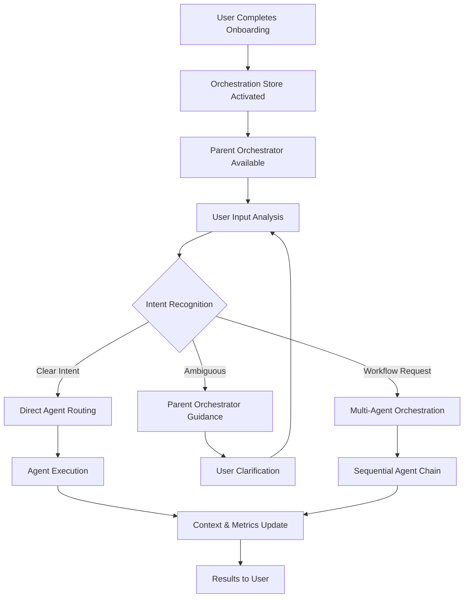

# Parent Orchestrator Agent - Complete Implementation Guide

## Overview

The Parent Orchestrator Agent is the intelligent coordination hub for the EAC ecosystem. It serves as the primary interface after users complete onboarding, providing intelligent routing, workflow automation, and comprehensive guidance throughout the user journey.

## Architecture

### Core Components

| Component | Path | Purpose |
|-----------|------|---------|
| **Parent Orchestrator Agent** | `eac/store/agents/parentOrchestratorAgent.ts` | Main orchestration agent with routing and workflow capabilities |
| **Agent Context Store** | `eac/store/agents/context.ts` | Cross-agent communication, metrics, and state management |
| **Orchestration Store** | `eac/store/agents/orchestration.ts` | Post-onboarding flow and intelligent routing logic |
| **Enhanced Agent Store** | `eac/store/agents/index.ts` | Updated with orchestration integration |
| **Registry Integration** | `eac/store/agents/registry.ts` | Enhanced with parent orchestrator registration |

### System Flow



## Features

### 🎯 Intelligent Routing

The parent orchestrator analyzes user input and routes to the most appropriate agent:

**Routing Rules:**
- **Twitter/Social**: Routes to Twitter Agent for content creation
- **Projects**: Routes to Project Creator for structure setup  
- **Instructions**: Routes to Instructions Agent for guidelines
- **Scheduling**: Routes to Scheduling Agent for timing optimization
- **Files**: Routes to File Creator for document management

**Confidence Scoring:**
- High confidence (>0.8): Direct routing with explanation
- Medium confidence (0.5-0.8): Suggestion with alternatives
- Low confidence (<0.5): Parent orchestrator guidance

### 🔄 Workflow Automation

Automated multi-agent workflows for complex tasks:

**Pre-defined Workflows:**
- **Social Media Master**: Content creation → Quality review → Scheduling
- **Project Documentation**: Code analysis → Doc generation → README creation
- **Brand Campaign**: Strategy definition → Content creation → Schedule optimization

**Custom Workflows:**
- Natural language goal description
- Automatic step generation based on available agents
- Sequential execution with error handling
- Progress tracking and rollback capabilities

### 📊 Metrics & Monitoring

Comprehensive system observability:

**Agent Metrics:**
- Success rates per agent
- Average response times
- Error tracking and categorization
- Usage patterns and trends

**System Health:**
- Overall performance indicators
- Active agent status
- Resource utilization
- User satisfaction tracking

### 🎓 Post-Onboarding Guidance

Seamless transition from onboarding to productive usage:

**Automatic Detection:**
- Monitors onboarding completion
- Triggers welcome guidance
- Provides personalized next steps

**Progressive Disclosure:**
- Basic features first
- Advanced capabilities revealed based on usage
- Contextual help and suggestions

## Commands Reference

### Core Commands

| Command | Purpose | Example |
|---------|---------|---------|
| `/guide` | Get personalized next steps | `/guide what should I do next?` |
| `/workflow` | Create automated workflows | `/workflow create social content and schedule it` |
| `/status` | View system status and metrics | `/status` |
| `/help` | Get intelligent help on any topic | `/help twitter posting` |

### Usage Examples

#### Basic Guidance
```bash
# Get personalized recommendations
/guide

# Get help with specific topics  
/help How do I create a Twitter campaign?

# Check system status
/status
```

#### Workflow Creation
```bash
# Social media automation
/workflow create engaging social content and schedule it for optimal times

# Project documentation
/workflow document my project completely with README and guides

# Brand campaign launch
/workflow launch a comprehensive brand campaign across platforms
```

#### Intelligent Routing
```bash
# These inputs will be automatically routed to appropriate agents:
"create a twitter post about AI innovation"
"set up a new project for my startup" 
"generate brand guidelines for my company"
"schedule my content for next week"
```

## Integration Points

### Chat System Integration

The parent orchestrator integrates seamlessly with the existing chat system:

```typescript
// In chatMessages.tsx - Enhanced routing
const handleSubmit = async () => {
  // Check if this should use intelligent routing
  if (shouldUseIntelligentRouting(message)) {
    const result = await agentStore.executeIntelligentRouting(
      message, 
      mutations, 
      sessionId
    );
    // Display result...
  }
  // ... existing logic
};
```

### Onboarding Completion Hook

Automatic activation after onboarding:

```typescript
// In onboarding store completion handler
completeOnboarding: () => {
  // ... existing logic
  
  // Trigger orchestrator activation
  const orchestrationStore = useOrchestrationStore.getState();
  orchestrationStore.showPostOnboardingGuidance();
}
```

### Context Preservation

Cross-agent state management:

```typescript
// Agent context automatically tracked
const contextStore = useAgentContextStore.getState();

// Execution tracking
contextStore.trackExecution({
  agentId: 'twitter-post',
  toolId: 'create-twitter-post',
  input: 'Create AI innovation post',
  status: 'running'
});

// Metrics collection
contextStore.updateMetrics('twitter-post', true, 1250);

// Cross-agent messaging
contextStore.sendAgentMessage(
  'parent-orchestrator',
  'twitter-post',
  { context: 'user prefers technical content' }
);
```

## Configuration

### Agent Registration

The parent orchestrator is automatically registered in the agent registry:

```typescript
// In registry.ts
constructor() {
  this.registerAgent(onboardingAgent);
  this.registerAgent(parentOrchestratorAgent); // Added second
  this.registerAgent(instructionsAgent);
  // ... other agents
}
```

### Routing Rules Customization

Modify routing logic in `orchestration.ts`:

```typescript
const routingRules = [
  {
    triggers: ['custom', 'my-keyword'],
    agentId: 'my-custom-agent',
    confidence: 0.9,
    reason: 'Custom functionality'
  },
  // ... existing rules
];
```

### Workflow Templates

Add new workflow templates:

```typescript
// In orchestration.ts - createWorkflowPlan function
if (goalLower.includes('my-workflow')) {
  return {
    steps: [
      {
        agentId: 'agent1',
        toolId: 'tool1',
        command: '/command1',
        input: processedGoal,
        status: 'pending'
      }
    ]
  };
}
```

## Best Practices

### 1. User Experience Principles

- **Progressive Disclosure**: Start simple, reveal complexity gradually
- **Clear Communication**: Always explain what will happen and why
- **Error Recovery**: Provide clear paths when things go wrong
- **Context Awareness**: Remember user preferences and history

### 2. Agent Coordination

- **Single Responsibility**: Each agent has clear, focused purpose
- **Loose Coupling**: Agents communicate through context store
- **Error Isolation**: One agent failure doesn't break the chain
- **Resource Management**: Track and limit concurrent executions

### 3. Performance Optimization

- **Caching**: Store frequently used routing decisions
- **Lazy Loading**: Load agents only when needed
- **Metrics Collection**: Monitor performance continuously
- **Graceful Degradation**: Fallback options when systems are busy

## Troubleshooting

### Common Issues

#### 1. Orchestrator Not Available
- **Symptom**: `/guide` commands not recognized
- **Cause**: User hasn't completed onboarding
- **Solution**: Complete onboarding flow first

#### 2. Poor Routing Decisions  
- **Symptom**: Commands routed to wrong agents
- **Cause**: Ambiguous user input or incomplete routing rules
- **Solution**: Add more specific triggers or improve intent analysis

#### 3. Workflow Execution Failures
- **Symptom**: Multi-step workflows break mid-execution
- **Cause**: Agent dependencies or missing context
- **Solution**: Improve error handling and add rollback mechanisms

### Debug Information

Enable detailed logging:

```typescript
// In development mode
console.log('🤖 Orchestrator routing decision:', {
  input: userInput,
  suggestedAgent: bestMatch?.agent.name,
  confidence: bestMatch?.confidence,
  reason: bestMatch?.reason
});
```

Check context store state:

```typescript
// Get current metrics and state
const contextStore = useAgentContextStore.getState();
const systemMetrics = contextStore.getSystemMetrics();
console.log('📊 System state:', systemMetrics);
```

## Future Enhancements

### Phase 1: Intelligence Improvements
- Machine learning for routing optimization
- User behavior pattern recognition
- Predictive agent suggestions
- Dynamic workflow generation

### Phase 2: Advanced Workflows
- Conditional branching in workflows
- Parallel agent execution
- User approval gates
- External system integration

### Phase 3: Ecosystem Expansion
- Plugin architecture for custom agents
- Third-party agent marketplace
- API endpoints for external integration
- Multi-tenant orchestration

## Benefits

### For Users
- **Simplified Experience**: Single entry point for all functionality
- **Intelligent Guidance**: AI-powered recommendations and routing
- **Workflow Automation**: Complex tasks executed automatically
- **Progressive Learning**: System adapts to user preferences

### For Developers
- **Modular Architecture**: Clean separation of concerns
- **Extensible Design**: Easy to add new agents and workflows
- **Rich Observability**: Comprehensive metrics and monitoring
- **Type Safety**: Full TypeScript integration throughout

### For the Platform
- **Improved Adoption**: Smoother onboarding and feature discovery
- **Higher Engagement**: Automated workflows increase usage
- **Better Analytics**: Rich data on user interactions and preferences
- **Scalable Growth**: Architecture supports adding new capabilities

## Conclusion

The Parent Orchestrator Agent transforms EAC from a collection of individual tools into a cohesive, intelligent platform that guides users toward success. By providing intelligent routing, workflow automation, and comprehensive guidance, it ensures users can unlock the full potential of the EAC ecosystem with minimal friction.

The modular architecture ensures the system can grow and adapt as new agents are added and user needs evolve, while the comprehensive metrics and monitoring provide the insights needed to continuously improve the user experience.
